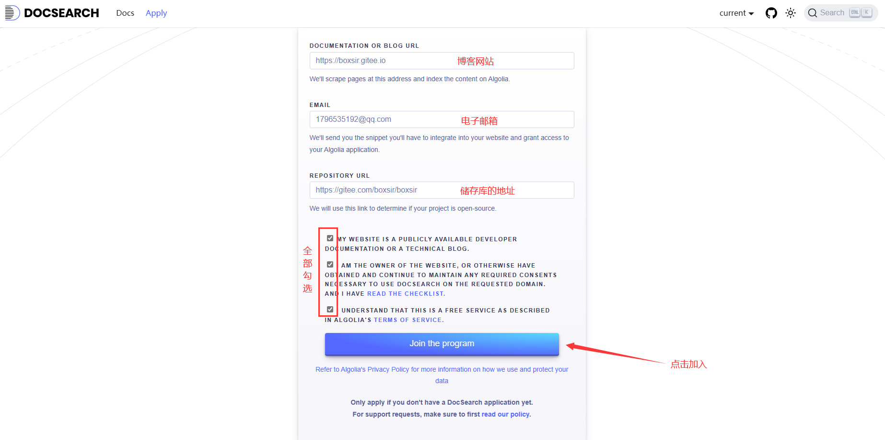
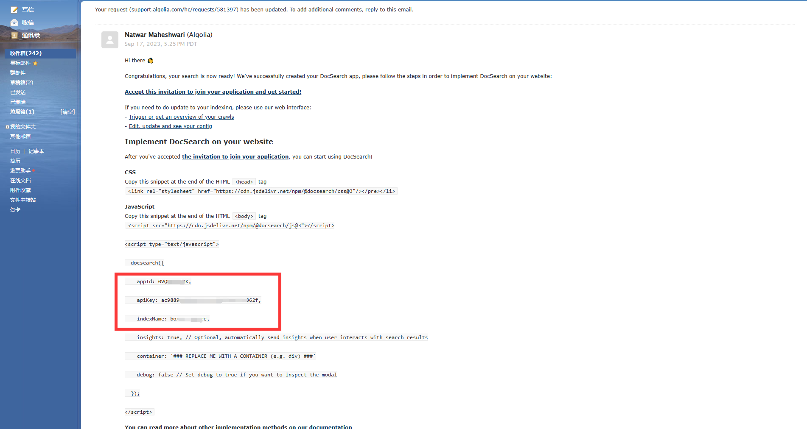
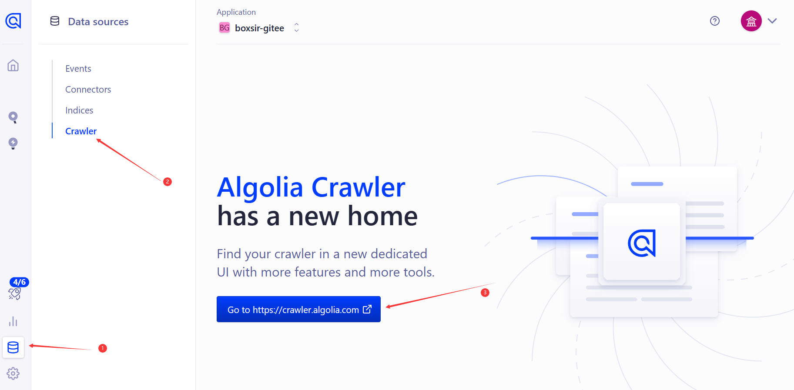
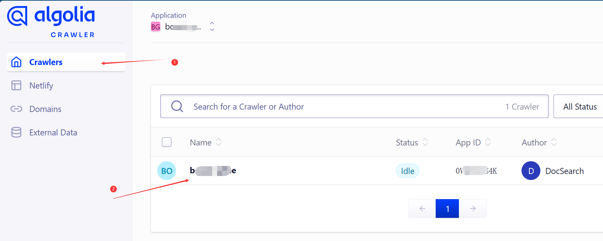
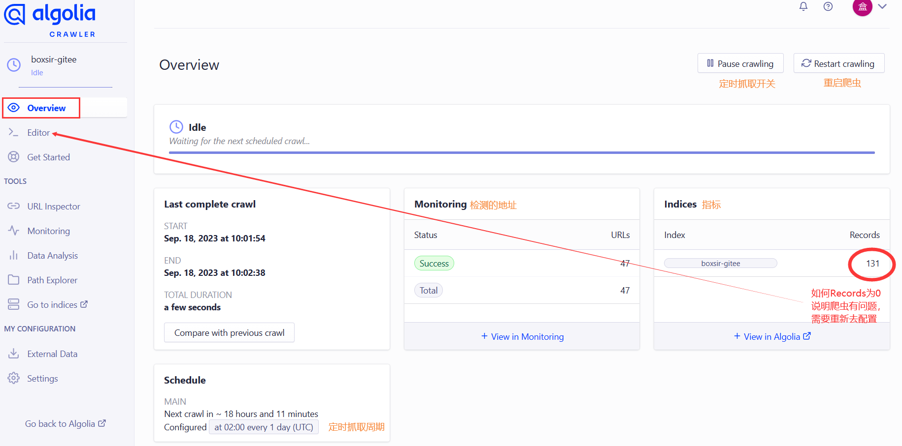
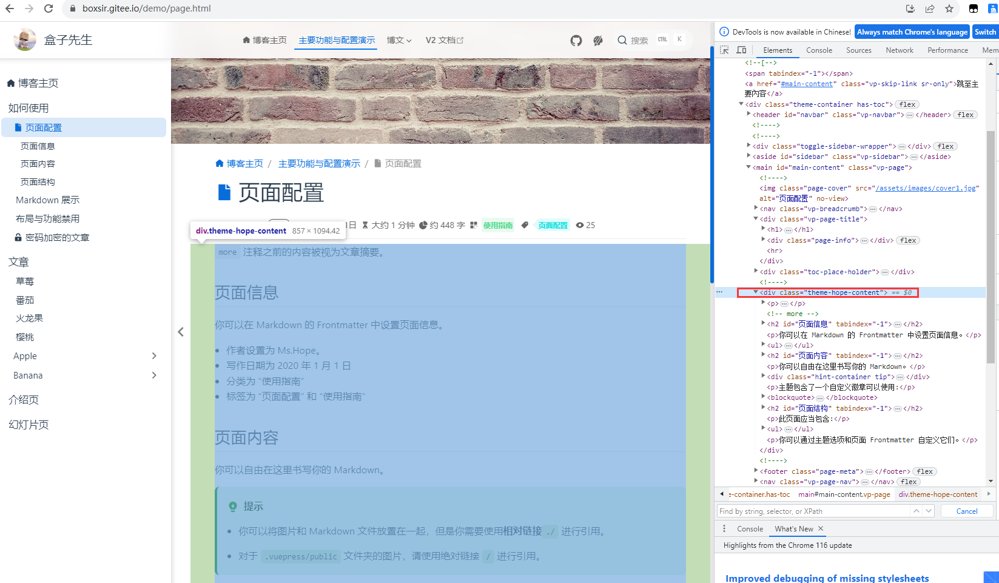
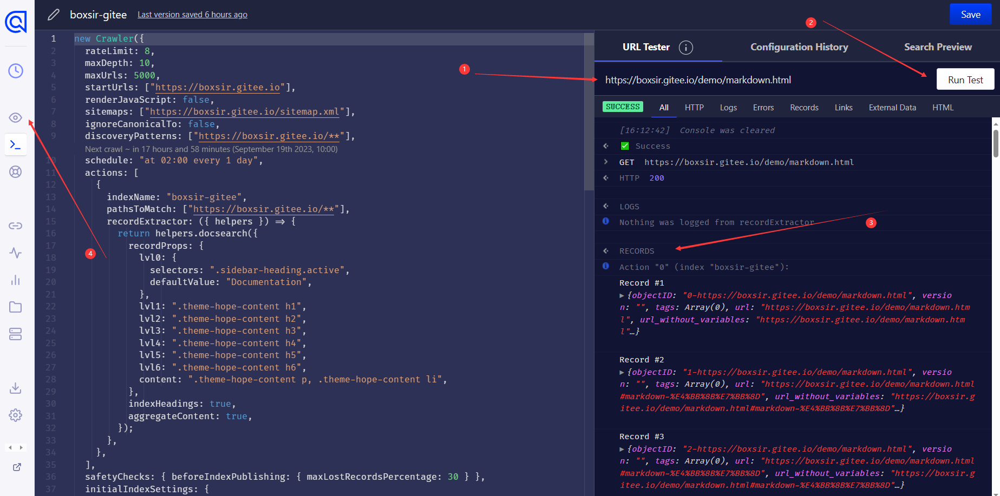
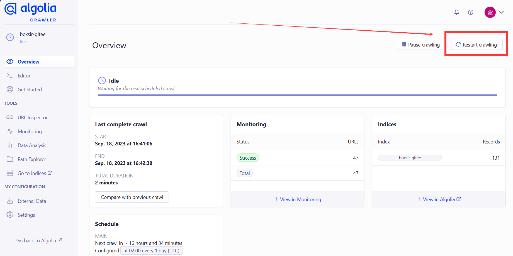

> VuePress-Theme-Hope主题对 `vuepress-plugin-search-pro`，`@vuepress/plugin-docsearch` 和`@vuepress/plugin-search` 三种搜索插件提供了内置支持。具体实现参考主题的[指南>功能>搜索](https://theme-hope.vuejs.press/zh/guide/feature/search.html)
> **盒子小屋**:house: 采用了`@vuepress/plugin-docsearch` 搜索插件

## 安装插件

1. 安装 `@vuepress/plugin-docsearch`

```sh
pnpm add -D @vuepress/plugin-docsearch@next
```

2. 从 `@vuepress/plugin-docsearch` 导入 `docsearchPlugin`，并在 `config.{ts,js}` 中的 `plugins` 应用。

```ts
// .vuepress/config.ts
import { docsearchPlugin } from "@vuepress/plugin-docsearch";
import { defineUserConfig } from "vuepress";

export default {
  plugins: [
    docsearchPlugin({
      // 配置项
    }),
  ],
};
```

关于 DocSearch 搜索插件的配置选项，详见 [插件文档](https://vuejs.press/zh/reference/plugin/docsearch.html)

## 提交网站获取秘钥

1. [进入网站提交页面](https://docsearch.algolia.com/apply/) ，填写网站信息来加入 DocSearch 项目。网站必须已经有博客内容，电子邮箱用于接受通知和后台的登录，储存库地址必须开源。[详细参考docsearch的文档](https://docsearch.algolia.com/docs/what-is-docsearch)
  

2. 申请后需要等待官方发来邮件。Algolia 会发来两封邮件，分别告知申请通过和爬取完成。盒子先生的申请通过邮件，大概等待了三天。官方发来的邮件中，提取出 `appId` `apiKey` 和 `indexName` 三个信息，根据自己使用的 Vuepress 框架的文档进行配置即可。
  

::: details 配置示例

   在 .vuepress/config.ts 文件下配置
   ```ts
   import { docsearchPlugin } from "@vuepress/plugin-docsearch";
   import { defineUserConfig } from "vuepress";

    export default defineUserConfig({
    plugins: [
       docsearchPlugin({  
         appId: "应用程序标识",
         apiKey: "搜索接口密钥", 
         indexName: "索引名称-gitee",
         locales: {
           "/": {
             placeholder: "搜素文档",
             translations: {
               button: {
                 buttonText: "搜索",
                 buttonAriaLabel: "搜索",
               },
               modal: {
                 searchBox: {
                   resetButtonTitle: "清除查询条件",
                   resetButtonAriaLabel: "清除查询条件",
                   cancelButtonText: "取消",
                   cancelButtonAriaLabel: "取消",
                 },
                 startScreen: {
                   recentSearchesTitle: "搜索历史",
                   noRecentSearchesText: "没有搜索历史",
                   saveRecentSearchButtonTitle: "保存至搜索历史",
                   removeRecentSearchButtonTitle: "从搜索历史中移除",
                   favoriteSearchesTitle: "收藏",
                   removeFavoriteSearchButtonTitle: "从收藏中移除",
                 },
                 errorScreen: {
                   titleText: "无法获取结果",
                   helpText: "你可能需要检查你的网络连接",
                 },
                 footer: {
                   selectText: "选择",
                   navigateText: "切换",
                   closeText: "关闭",
                   searchByText: "搜索提供者",
                 },
                 noResultsScreen: {
                   noResultsText: "无法找到相关结果",
                   suggestedQueryText: "你可以尝试查询",
                   reportMissingResultsText: "你认为该查询应该有结果？",
                   reportMissingResultsLinkText: "点击反馈",
                 },
               },
             },
           },
         },
       }),
     ],
     });
   ```

:::

3. 邮箱中的apiKey权限较高，能创建、更新和删除索引，建议在[Algolia后台](https://dashboard.algolia.com/users/sign_in)获取这个应用的`Search API Key` 这是可以在前端代码中安全使用的公共 API 密钥，仅可用于搜索，相对安全。


4. 配置完成后，尝试在博客搜索一个关键词，确保网站中有文档包含这一关键词。（如果正常返回了搜索结果，那么恭喜你已经完成了配置；如果搜什么都是 No Results，那么还需要“修改爬虫配置”）

   跳转爬网工具
   

## 修改爬虫配置

1. Algolia 爬取时，只将每个页面匹配指定的元素选择器的元素下的文字建立索引，因此对于大多数情况需要手动指定选择器。前往 [Algolia Crawler](https://crawler.algolia.com/admin/crawlers/) 来更新爬虫配置
  
  

2. 配置中 `initialIndexSettings.YOUR_INDEX_NAME.attributesForFaceting` 字段**必须**包含 `"lang"` ，否则该插件将无法正常工作。


::: details 配置选项和说明
```ts
new Crawler({
  appId: "YOUR_APP_ID",
  apiKey: "YOUR_API_KEY",
  rateLimit: 8,
  startUrls: [
    // 这是 Algolia 开始抓取网站的初始地址
    // 如果你的网站被分为数个独立部分，你可能需要在此设置多个入口链接
    "https://YOUR_WEBSITE_URL/",
  ],
  sitemaps: [
    // 如果你在使用 Sitemap 插件 (如: vuepress-plugin-sitemap2)，你可以提供 Sitemap 链接
    "https://YOUR_WEBSITE_URL/sitemap.xml",
  ],
  ignoreCanonicalTo: false,
  exclusionPatterns: [
    // 你可以通过它阻止 Algolia 抓取某些 URL
  ],
  discoveryPatterns: [
    // 这是 Algolia 抓取 URL 的范围
    "https://YOUR_WEBSITE_URL/**",
  ],
  // 爬虫执行的计划时间，可根据文档更新频率设置
  schedule: "at 02:00 every 1 day",
  actions: [
    // 你可以拥有多个 action，特别是你在一个域名下部署多个文档时
    {
      // 使用适当的名称为索引命名
      indexName: "YOUR_INDEX_NAME",
      // 索引生效的路径
      pathsToMatch: ["https://YOUR_WEBSITE_URL/**"],
      // 控制 Algolia 如何抓取你的站点
      recordExtractor: ({ $, helpers }) => {
        // 以下是适用于 vuepress-theme-hope 的默认选项选项
        // vuepress-theme-hope 默认的容器类名为 theme-hope-content
        return helpers.docsearch({
          recordProps: {
            lvl0: {
              selectors: ".sidebar-heading.active",
              defaultValue: "Documentation",
            },
            lvl1: ".theme-hope-content h1",
            lvl2: ".theme-hope-content h2",
            lvl3: ".theme-hope-content h3",
            lvl4: ".theme-hope-content h4",
            lvl5: ".theme-hope-content h5",
            lvl6: ".theme-hope-content h6",
            content: ".theme-hope-content p, .theme-hope-content li",
          },
          indexHeadings: true,
        });
      },
    },
  ],
  initialIndexSettings: {
    // 控制索引如何被初始化，这仅当索引尚未生成时有效
    // 你可能需要在修改后手动删除并重新生成新的索引
    YOUR_INDEX_NAME: {
      attributesForFaceting: ["type", "lang"],
      attributesToRetrieve: ["hierarchy", "content", "anchor", "url"],
      attributesToHighlight: ["hierarchy", "hierarchy_camel", "content"],
      attributesToSnippet: ["content:10"],
      camelCaseAttributes: ["hierarchy", "hierarchy_radio", "content"],
      searchableAttributes: [
        "unordered(hierarchy_radio_camel.lvl0)",
        "unordered(hierarchy_radio.lvl0)",
        "unordered(hierarchy_radio_camel.lvl1)",
        "unordered(hierarchy_radio.lvl1)",
        "unordered(hierarchy_radio_camel.lvl2)",
        "unordered(hierarchy_radio.lvl2)",
        "unordered(hierarchy_radio_camel.lvl3)",
        "unordered(hierarchy_radio.lvl3)",
        "unordered(hierarchy_radio_camel.lvl4)",
        "unordered(hierarchy_radio.lvl4)",
        "unordered(hierarchy_radio_camel.lvl5)",
        "unordered(hierarchy_radio.lvl5)",
        "unordered(hierarchy_radio_camel.lvl6)",
        "unordered(hierarchy_radio.lvl6)",
        "unordered(hierarchy_camel.lvl0)",
        "unordered(hierarchy.lvl0)",
        "unordered(hierarchy_camel.lvl1)",
        "unordered(hierarchy.lvl1)",
        "unordered(hierarchy_camel.lvl2)",
        "unordered(hierarchy.lvl2)",
        "unordered(hierarchy_camel.lvl3)",
        "unordered(hierarchy.lvl3)",
        "unordered(hierarchy_camel.lvl4)",
        "unordered(hierarchy.lvl4)",
        "unordered(hierarchy_camel.lvl5)",
        "unordered(hierarchy.lvl5)",
        "unordered(hierarchy_camel.lvl6)",
        "unordered(hierarchy.lvl6)",
        "content",
      ],
      distinct: true,
      attributeForDistinct: "url",
      customRanking: [
        "desc(weight.pageRank)",
        "desc(weight.level)",
        "asc(weight.position)",
      ],
      ranking: [
        "words",
        "filters",
        "typo",
        "attribute",
        "proximity",
        "exact",
        "custom",
      ],
      highlightPreTag:
        '<span class="algolia-docsearch-suggestion--highlight">',
      highlightPostTag: "</span>",
      minWordSizefor1Typo: 3,
      minWordSizefor2Typos: 7,
      allowTyposOnNumericTokens: false,
      minProximity: 1,
      ignorePlurals: true,
      advancedSyntax: true,
      attributeCriteriaComputedByMinProximity: true,
      removeWordsIfNoResults: "allOptional",
    },
  },
});
```
:::

3. 其实就是需要根据自己网站的正文在 HTML 文档中的所处元素位置来告诉 Algolia 要从什么元素提取文字。如对于我使用的 VuePress-Theme-Hope 主题，就需要从 `.theme-hope-content` 中提取
  

4. 修改好后，在网站右侧的 URL Tester 中可以输入自己网站某个界面的网址进行测试（注意选择正文界面而非首页，毕竟首页并没有东西用来建索引），如果看到 Records 中有内容就是成功啦。
  

5. 回到Algolia的Overview（标注4的小眼睛），点击右上角的 Restart crawling 按钮重新启动爬虫，耐心等待爬取完成！
  

前往博客，测试搜索功能成功实现
  

## 执行爬虫 :pushpin:

1. 盒子先生的博客爬虫规则，已经配置了在每天早上的2点执行(默认UTC时间，和北京时间相差8小时)

```js
// 爬虫执行的计划时间，可根据文档更新频率设置
  schedule: "at 02:00 every 1 day",
```

2. 如果推送了新文章，希望立刻实现对新文章的搜索，可手动重启爬虫！前往 [Algolia Crawler](https://crawler.algolia.com/admin/crawlers/) 来手动重启爬虫
  