VuePress-Theme-Hope主题的评论服务目前可以从 Giscus、Waline、Twikoo 和 Artalk 中选择。具体实现参考主题的[指南>功能>评论](https://theme-hope.vuejs.press/zh/guide/feature/comment.html)

盒子先生的博客采用了 [Waline](https://theme-hope.vuejs.press/zh/guide/feature/comment.html#waline) | [配置指南](https://plugin-comment2.vuejs.press/zh/guide/waline.html) | [官网文档](https://waline.js.org/)

## 快速部署

### 注册LeanCloud (数据库)

1.  [登录](https://console.leancloud.app/login) 或 [注册](https://console.leancloud.app/register) `LeanCloud 国际版` 。推荐使用国际版，否则需要为应用额外绑定**已备案**的域名，同时购买独立 IP 并完成备案接入
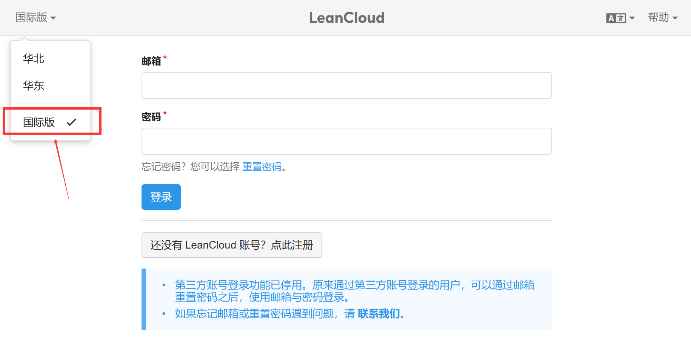
2.  进入 [控制台](https://console.leancloud.app/applist.html#/apps) 后点击左上角 [创建应用](https://console.leancloud.app/applist.html#/newapp)。起一个喜欢的名字 (选择免费的开发版):

3.  创建应用后进入该应用，选择左下角的 `设置` > `应用凭证`，然后记下 `APP ID`,`APP Key` 和 `Master Key`。转至 Vercel 进行快速部署。


### Vercel 部署服务

1. 转至 [Vercel](https://vercel.com/new/clone?repository-url=https%3A%2F%2Fgithub.com%2Fwalinejs%2Fwaline%2Ftree%2Fmain%2Fexample) 进行 Server 端部署，用 GitHub 账户进行快捷登录。输入一个喜欢的 Vercel 项目名称并点击 `Create` 继续
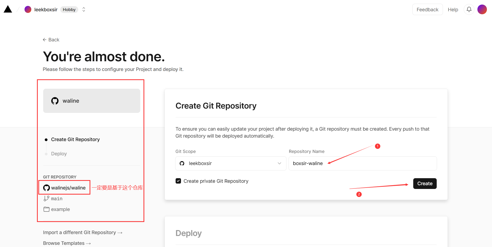

2. 此时 Vercel 会基于 Waline 模板新建并初始化GitHub仓库，仓库名为你之前输入的项目名。

   构建中
   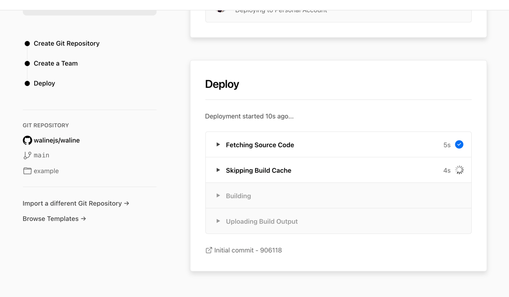

   构建完成后，Github中可以看到创建对应私有仓库
   

   满屏的烟花会庆祝你部署成功。此时点击 `Go to Dashboard` 可以跳转到应用的控制台。
   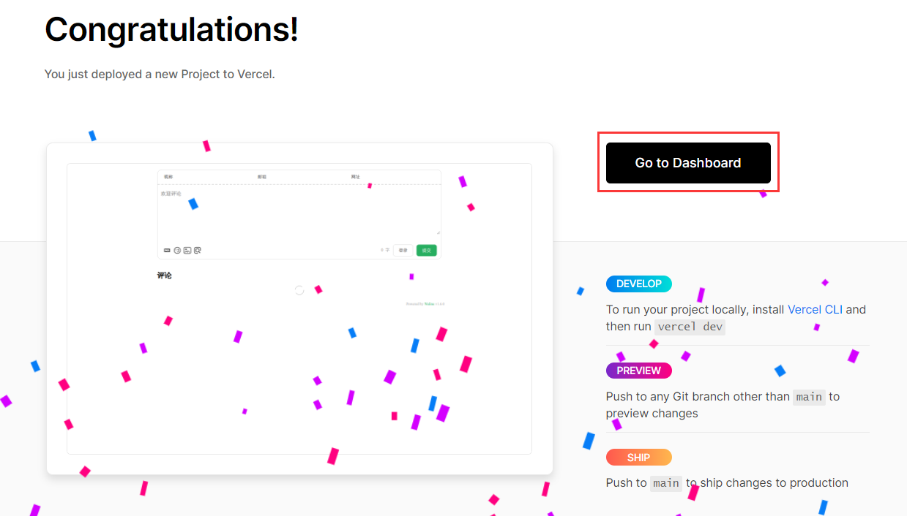

3. 点击顶部的 `Settings` - `Environment Variables` 进入环境变量配置页，并配置三个环境变量 `LEAN_ID`, `LEAN_KEY` 和 `LEAN_MASTER_KEY` 。它们的值分别对应上一步在 LeanCloud 中获得的 `APP ID`, `APP KEY`, `Master Key`。
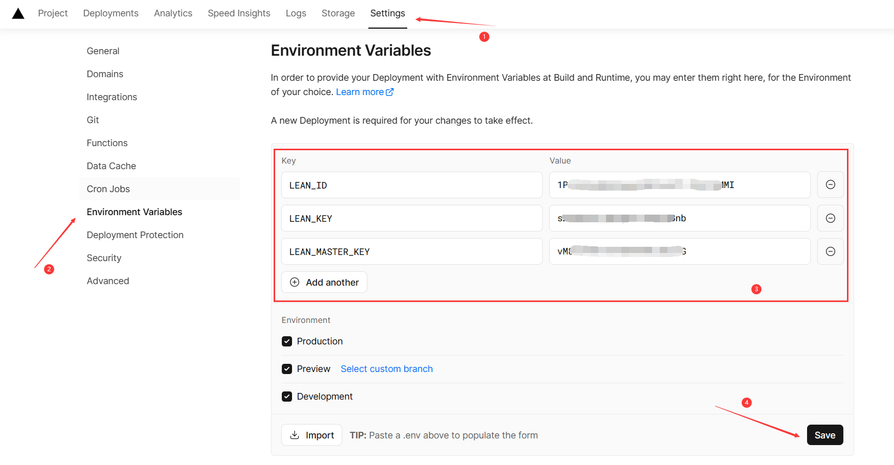

   如果使用 LeanCloud 国内版，额外配置 `LEAN_SERVER` 环境变量，值为绑定好的域名。

4. 环境变量配置完成之后点击顶部的 `Deployments` 点击顶部最新的一次部署右侧的 `Redeploy` 按钮进行重新部署。该步骤是为了让刚才设置的环境变量生效。


5. 等待片刻后 `STATUS` 会变成 `Ready`。此时请点击 `Visit` ，即可跳转到部署好的网站地址，此地址即为你的服务端地址。


   如果`Visit` 跳转地址显示无法访问，这是因为vercel.app的域名被墙了，可以利用翻墙访问。

   推荐还是在vercel的 `Settings` - `Domains` 进入域名配置页**绑定自己的域名**，不用翻墙也可以访问。


### 绑定域名 

1. 在域名服务器商处添加新的 `CNAME` 解析记录

   |  Name   | Type  |        Value         |
   | :-----: | :---: | :------------------: |
   | example | CNAME | cname.vercel-dns.com |

   例如：
   

2. 点击Vercel后台顶部的 `Settings` - `Domains` 进入域名配置页，输入需要绑定的域名并点击 `Add`


3. 等待生效，可以通过自己的域名来访问了🎉

   - 评论系统：example.<你的域名>.com
   - 评论管理：example.<你的域名>.com/ui

   


### 主题引入（Waline客户端）

```js
// .vuepress/config.ts
import { defineUserConfig } from "vuepress";
import { hopeTheme } from "vuepress-theme-hope";

export default defineUserConfig({
  theme: hopeTheme({
    plugins: {
      comment: {
        provider: "Waline",
        serverURL: "YOUR_SERVER_URL", // 你的客户端地址
        copyright: false,         	// 是否显示页脚版权信息(Powered by Waline v2.15.7)
      	reaction: true,           // 开启反应（你认为这篇文章怎么样？）
      },
    },
  }),
});
```

基础功能完成🎉
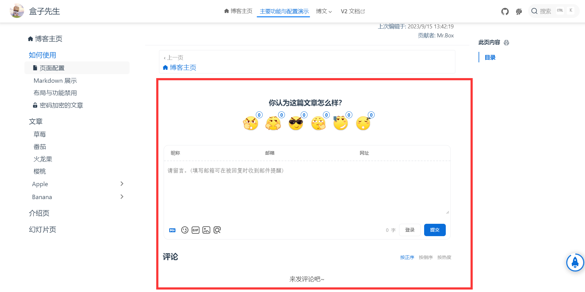

Waline 评论的其他配置将在 [主题插件配置](https://plugin-comment2.vuejs.press/zh/config/waline.html) | [waline官网组件属性](https://waline.js.org/reference/client/props.html) 中列出。


## 后台管理

### 评论管理

1. 部署完成后，请访问 `<serverURL>/ui/register` 进行注册。首个注册的人会被设定成管理员。

   例如：盒子博客评论的后台管理地址是 [https://waline.cailei.site/ui](https://waline.cailei.site/ui) 
   

2. 管理员登陆后，即可看到评论管理界面。在这里可以修改、标记或删除评论。


### 用户管理

**管理员账号**，可对评论系统用户进行管理，设置管理员和添加专属标签


### 普通用户后台

普通用户也可通过评论框注册账号。


登陆后会点击头像，会跳转到自己的档案页，设置自己的昵称、主页、专属标签。
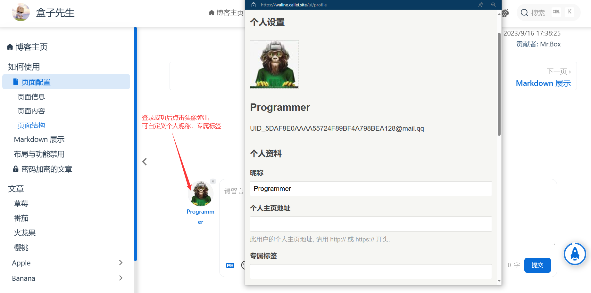


## 数据管理

### 多数据库服务

除了官方默认的 LeanCloud 之外，Waline 还支持多种数据库，包括 MySQL, PostgreSQL, SQLite 以及 MongoDB等。详细参考Waline的 [多数据库服务支持](https://waline.js.org/guide/database.html)

### 管理数据

盒子博客评论区的数据使用了 [LeanCloud](https://www.leancloud.cn/)

1. 进入到自己的应用
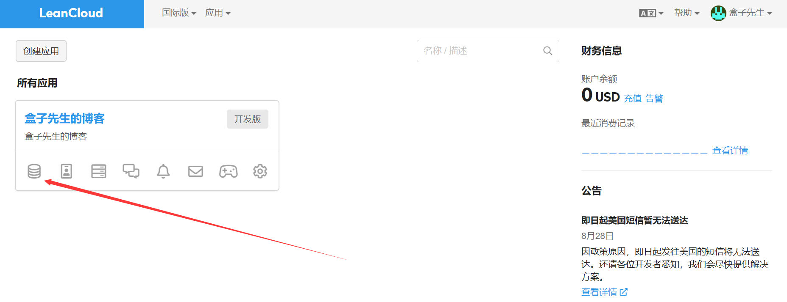
2. 可以对游客反馈、浏览量、评论信息之类的数据进行手动修改
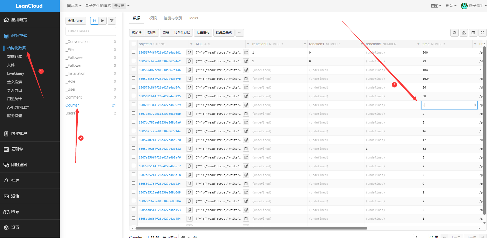


## 开通评论通知服务

### 介绍

当有用户发布评论或者用户回复评论时，Waline 支持对博主和回复评论作者进行通知。

- 博主通知支持多种方式，包括 [邮件](https://waline.js.org/guide/features/notification.html#%E9%82%AE%E4%BB%B6%E9%80%9A%E7%9F%A5) | [微信](https://waline.js.org/guide/features/notification.html#%E5%BE%AE%E4%BF%A1%E9%80%9A%E7%9F%A5) | [企业微信](https://waline.js.org/guide/features/notification.html#%E4%BC%81%E4%B8%9A%E5%BE%AE%E4%BF%A1%E5%BA%94%E7%94%A8%E9%80%9A%E7%9F%A5) | [QQ](https://waline.js.org/guide/features/notification.html#qq-%E9%80%9A%E7%9F%A5) | [Telegram](https://waline.js.org/guide/features/notification.html#telegram-%E9%80%9A%E7%9F%A5) | [PushPlus ](https://waline.js.org/guide/features/notification.html#pushplus-%E9%80%9A%E7%9F%A5) | [Discord](https://waline.js.org/guide/features/notification.html#discord-%E9%80%9A%E7%9F%A5) | [飞书](https://waline.js.org/guide/features/notification.html#%E9%A3%9E%E4%B9%A6%E9%80%9A%E7%9F%A5) 
- 当访客的评论收到回复时，会对访客进行邮件通知。

盒子先生采用了 **PushPlus** 通知， [pushplus](http://www.pushplus.plus/) 集成了微信、企业微信、钉钉、短信、邮件等渠道的信息推送平台。需要配置以下几个环境变量，具体的参数格式见 [pushplus文档](http://www.pushplus.plus/doc/guide/api.html#%E4%B8%80%E3%80%81%E5%8F%91%E9%80%81%E6%B6%88%E6%81%AF%E6%8E%A5%E5%8F%A3) ：

- `PUSH_PLUS_KEY`： 用户令牌，即 `token`，必填。
- `PUSH_PLUS_TOPIC`：群组编码，不填仅发送给自己；channel 为 webhook 时无效
- `PUSH_PLUS_TEMPLATE`：发送模板默认值html
- `PUSH_PLUS_CHANNEL`：发送渠道
- `PUSH_PLUS_WEBHOOK`：webhook 编码，仅在 channel 使用 webhook 渠道和 CP 渠道时需要填写
- `PUSH_PLUS_CALLBACKURL`：发送结果回调地址
- `AUTHOR_EMAIL`: 博主邮箱，用来区分发布的评论是否是博主本身发布的。如果是博主发布的则不进行提醒通知。
- `SITE_NAME`: 网站名称，用于在消息中显示。
- `SITE_URL`: 网站地址，用于在消息中显示。

### 开通PushPlus

盒子先生采用**PushPlus** 的**邮件通知**

1. 使用微信扫码登录[pushplus](http://www.pushplus.plus/login.html) 可以在后台对邮件通知的渠道进行测试，获取到token


   使用邮件渠道推送消息需要消息的接收方配置好自己的邮箱地址，否则将无法推送消息。
   在一对多的群组中如部分接收用户未配置邮箱，不会影响其他已配置用户的接收。

2. 点击**pushplus 推送加**公众号菜单里面的“功能”>“个人中心”>“个人资料”>“邮箱” 绑定自己的邮箱。
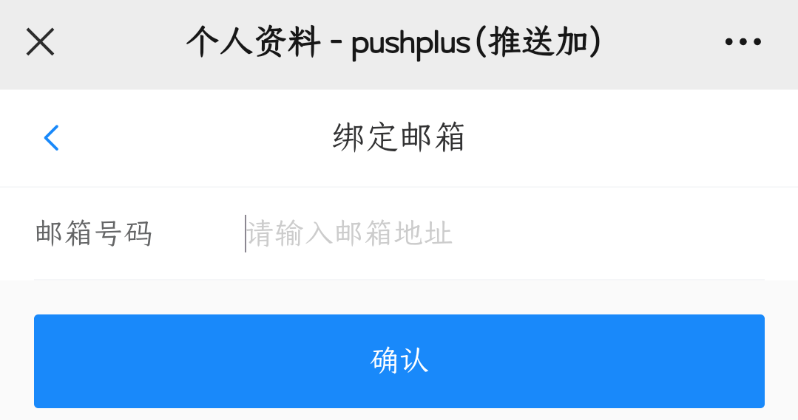

3. 输入自己的“邮箱地址”，系统会发送一份验证邮件到绑定的邮箱中。登录自己的邮箱，点击验证邮件正文中的链接。

   


### 配置vercel环境变量

1. 转至vercel点击项目顶部的 `Settings` - `Environment Variables` 进入环境变量配置页，盒子先生没有回调地址，没有群组，发送模板采用默认，所以只配置了`PUSH_PLUS_KEY` ，`PUSH_PLUS_CHANNEL` ，`AUTHOR_EMAIL`，`SITE_NAME` 和`SITE_URL` 

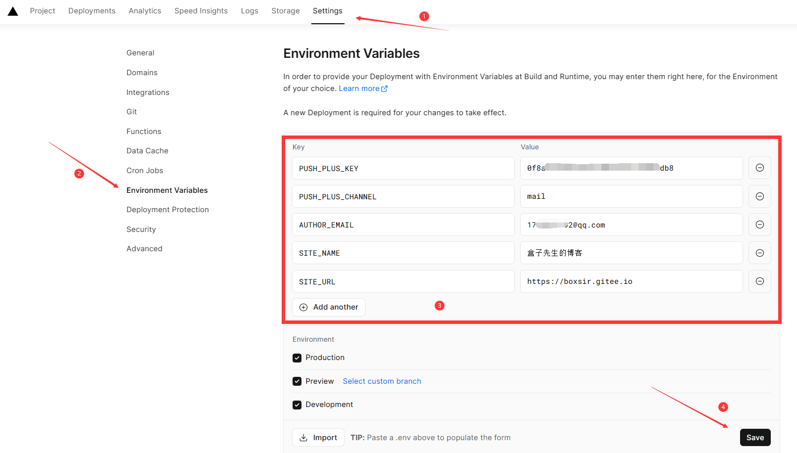

2.环境变量配置完成之后点击顶部的 `Deployments` 点击顶部最新的一次部署右侧的 `Redeploy` 按钮进行重新部署。该步骤是为了让刚才设置的环境变量生效。


### 测试评论通知

1. 前往盒子先生博客的评论区，填写评论内容
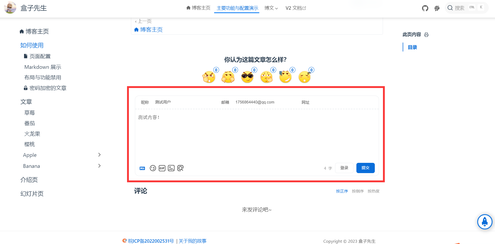
2. 接收到邮箱提醒


3. 跳转到该条评论位置，对评论进行回复
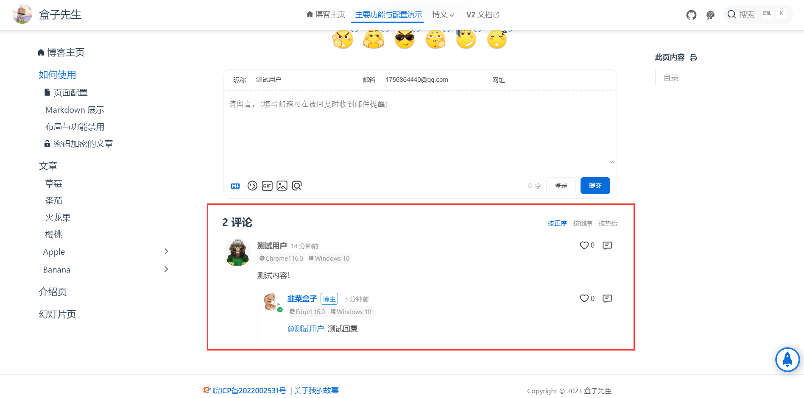

4. 个人中心、评论通知开关、历史消息等设置，可在**pushplus推送加**公众号中设置

   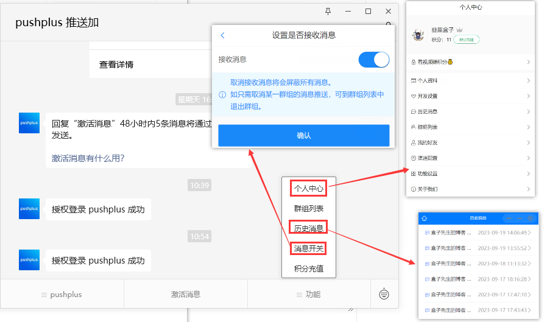

